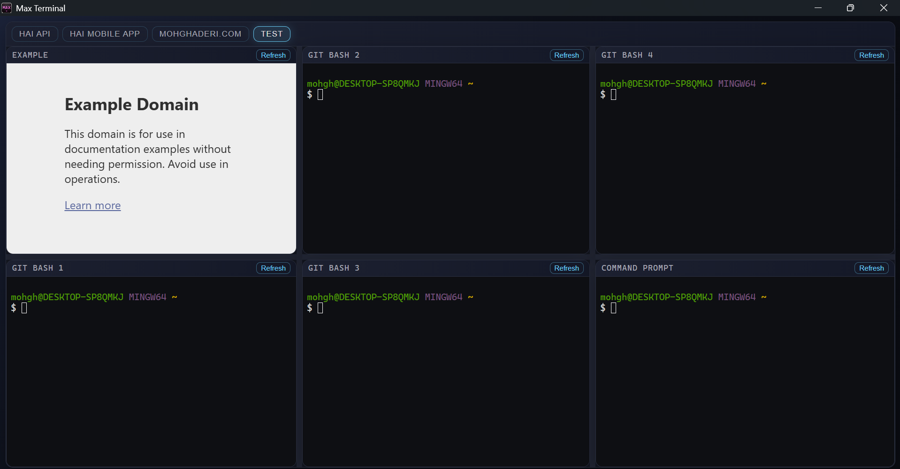

# Max Terminal

A configurable, split-pane desktop workspace for terminals and web dashboards. 
Max Terminal lets you design a multi-tab layout in JSON and launch a focused, 
repeatable dev cockpit in seconds.

## Screenshot



## Why it's useful
- One window for shells, dashboards, docs, and logs.
- Layouts are pure JSON, easy to version with your project.
- Terminals can auto-run setup commands on launch.
- Web panes refresh independently without losing the rest of your workspace.

## Key features
- Config-driven tabs with nested splits (`row` / `column`).
- Terminal panes powered by xterm.js + node-pty.
- Web panes powered by Electron webview.
- Per-tab content overrides (keep layout + content together).
- Refresh any pane without restarting the app.

Great for
- Spinning up consistent dev environments for teams.
- Keeping terminals, dashboards, and docs side by side.
- Running multi-repo workflows without window sprawl.

## Requirements
- Node.js 20+ (Node 24 recommended; see `package.json` for Volta).

## Quick start
1. Install dependencies: `npm install`
2. Start the app: `npm start`

Project-level layouts
Max Terminal loads tab JSON files from either `conf/tabs` or `tabs` (files starting with `_` are ignored). Each file becomes a top-level tab.

You can define pane content in two ways:
- Global `content.json` at the project root.
- Inline `content` in a tab file (merged on top of `content.json`).

## Tab file example (`conf/tabs/dev.json`)
```json
{
  "tabTitle": "Dev",
  "layout": {
    "type": "split",
    "direction": "row",
    "sizes": [0.6, 0.4],
    "children": [
      { "contentId": "devTerminal" },
      {
        "type": "tabs",
        "activeIndex": 0,
        "children": [
          { "contentId": "runTerminal", "tabTitle": "Run" },
          { "contentId": "docsWeb", "tabTitle": "Docs" }
        ]
      }
    ]
  },
  "content": {
    "devTerminal": {
      "type": "terminal",
      "title": "Dev Shell",
      "shell": "cmd.exe",
      "initialCommands": ["npm install", "npm run dev"]
    },
    "runTerminal": {
      "type": "terminal",
      "title": "Runner"
    },
    "docsWeb": {
      "type": "web",
      "title": "Docs",
      "url": "https://example.com"
    }
  }
}
```

## Layout node types
- `split`: `{ "type": "split", "direction": "row" | "column", "sizes": [0.6, 0.4], "children": [...] }`
- `tabs`: `{ "type": "tabs", "activeIndex": 0, "children": [...] }`
- `terminal`: `{ "contentId": "devTerminal" }`
- `web`: `{ "contentId": "docsWeb" }`

## Content entries
- Terminal: `{ "type": "terminal", "title": "Git Bash", "shell": "C:/Program Files/Git/bin/bash.exe", "args": ["--login", "-i"], "cwd": "C:/work", "initialCommands": ["npm run dev"] }`
- Web: `{ "type": "web", "title": "Docs", "url": "https://example.com" }`

## Tips
- Keep per-project layouts in `conf/tabs` so each repo opens with its own workspace.
- Use `initialCommands` to bootstrap dev servers or tooling in every pane.
- If you don't see tabs, add at least one JSON file under `conf/tabs`.

## Build a distributable
`npm run dist`

## Troubleshooting
- If a terminal won't start after installing dependencies, run `npx electron-rebuild -f -w node-pty` and restart.

## Want to contribute?
Open a PR with a sample layout, new pane types, or UI polish ideas.
